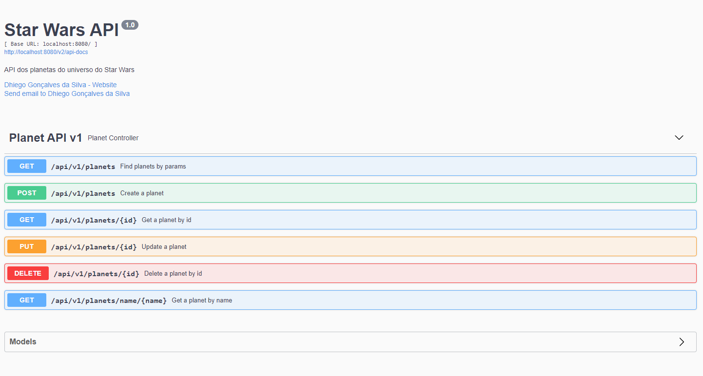
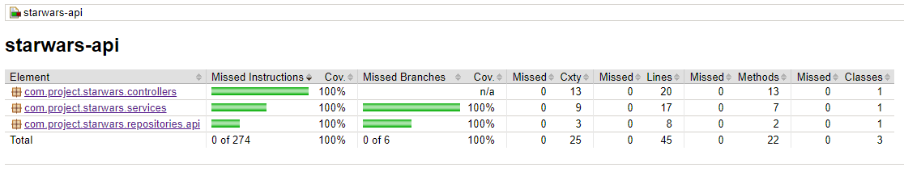

<h1 align="center">
   Star Wars API
</h1>

## :books: Tecnologias

Este projeto foi desenvolvido com:

-   [Spring Boot](https://spring.io/projects/spring-boot)
-   [Spring Data MongoDB](https://spring.io/projects/spring-data-mongodb)
-   [Lombok](https://projectlombok.org/)
-   [ModelMapper](http://modelmapper.org/)
-   [JaCoCo](https://www.jacoco.org/jacoco/)
-   [Swagger](https://github.com/springfox/springfox)

## :computer: Projeto

O Projeto é uma API dos planetas do universo do Star Wars implementando o conceito CRUD.

<p align="center">
    
</p>

### Cobertura dos testes do projeto

<p align="center">
    
</p>

## :rocket: Iniciar a aplicacão

### Pré-requisitos

-   [Java JDK 11](https://www.oracle.com/br/java/technologies/javase-jdk11-downloads.html)
-   [Maven](https://maven.apache.org/download.cgi)
-   [mongoDB](https://www.mongodb.com/)
-   [Docker Engine \*](https://docs.docker.com/engine/install/)
-   [Docker Compose \*](https://docs.docker.com/compose/install/)

---

Clone o repositório.

```console
git clone https://github.com/dhiegogoncalves/starwars-api.git
cd starwars-api
```

Dentro da pasta do projeto verifique a conexão com o banco de dados mongodb nos arquivos `src/main/resources/application-test.properties` e `src/main/resources/application.properties`.

```console
spring.data.mongodb.host=localhost
spring.data.mongodb.port=28017
spring.data.mongodb.database=test_database
```

Execute o comando abaixo para iniciar o projeto.

```console
mvn spring-boot:run
```

Em seguida, acesse o link [http://localhost:5000/swagger-ui/](http://localhost:5000/swagger-ui/).

Caso queira executar o `docker-compose` na pasta do projeto execute o comando abaixo para dar build no projeto.

```console
mvn clean package
```

Execute o comando abaixo para iniciar o projeto utilizando docker-compose.

```console
docker-compose up --build
```

Em seguida, acesse o link [http://localhost:8080/swagger-ui/](http://localhost:8080/swagger-ui/).
